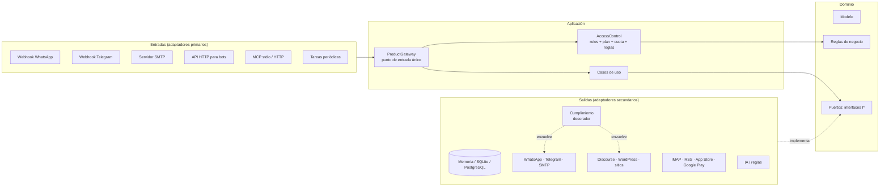

# Sin Humo: arquitectura

Arquitectura hexagonal (puertos y adaptadores) aplicando SOLID.

> **Regla central: las dependencias apuntan hacia adentro.** El dominio no conoce nada externo. Los casos de uso solo conocen interfaces. Las clases concretas (WhatsApp, SMTP, PostgreSQL, IA, foros) viven afuera y se conectan en un único lugar: la raíz de composición.



## Carpetas

```
src/
  domain/
    model/        Entidades puras: notas, afirmaciones, usuarios, roles, planes, contenido,
                  respuestas, impacto, reseñas, cumplimiento, integraciones
    ports/        Interfaces: lo que el sistema NECESITA, sin decir CÓMO (75 interfaces)
    rules/        Reglas de negocio puras (acceso, política de roles)
  application/    Casos de uso. Solo dependen de puertos.
    access/       ProductGateway, AccessControl, catálogo de acciones
    messaging/    Mensajes entrantes, notificaciones, registro de canales, respuestas neutras
    content/      Análisis de contenido, conectar/sincronizar fuentes, recibir mails
    users/        Alta, roles, planes y pagos, reglas guardadas, alertas, vincular canales
    replies/      Respuestas en cualquier destino + links de seguimiento
    impact/       Medición y reporte de impacto
    reviews/      Calificaciones y reseñas
    integrations/ Claves de API y webhooks
    compliance/   Cumplimiento y reputación de envío
  infrastructure/ Adaptadores concretos (uno por tecnología)
  config/         Catálogo: roles, planes, políticas por plataforma (datos, no código)
  composition/    Raíces de composición: el ÚNICO lugar que hace `new` de clases concretas
  entry/          Servidor de producción y servidor MCP por stdio
tests/            99 tests. La plataforma completa corre sobre memoria, SQLite y PostgreSQL
```

## SOLID en este código

| Principio | Dónde se ve |
|---|---|
| **S**: responsabilidad única | `SourceCollector` solo junta fuentes. `AccessControl` solo decide acceso. `ComplianceGuard` solo decide si se puede enviar. Cada regla de negocio, dimensión de credibilidad, publicador y recolector de impacto es una clase aparte. |
| **O**: abierto/cerrado | El motor de reglas recibe `IBusinessRule[]`. El de credibilidad recibe `ICredibilityDimension[]`. El análisis de contenido recibe `ISignalProvider[]`. Canales, publicadores, recolectores y fuentes de reseñas son listas: **se agrega una clase, no se modifica ninguna**. |
| **L**: sustitución de Liskov | Memoria, SQLite y PostgreSQL pasan **la misma batería de tests**. El detector por reglas y el de IA son intercambiables. `RecordingSender` y `WhatsAppCloudSender` también. |
| **I**: segregación de interfaces | Repositorios de lectura y escritura separados. `IMessageSender`, `IInboundParser` e `IChannelRenderer` son tres interfaces distintas para un mismo canal. `IEmailTransport` (enviar) está separado de `IInboundMailServer` (recibir) y de `IContentSource` (leer un buzón). |
| **D**: inversión de dependencias | Ningún caso de uso importa una clase concreta. Hasta el reloj (`IClock`), el HTTP (`IHttpClient`) y la espera (`wait`) se inyectan, por eso todo se prueba sin red y sin esperar. |

## Flujo de un pedido (igual para todos los canales)

```
WhatsApp / Telegram / mail / API / MCP / web
   → adaptador de entrada (parser del canal, clave de API…)
   → ProductGateway
       → UserRulesResolver   (reglas de URL del usuario y de su organización)
       → AccessControl       (carga usuario, permisos, plan, uso)
           → BusinessRuleEngine: usuario activo → suscripción vigente → permiso del rol
             → funcionalidad del plan → canal del plan → cuota → límites del pedido
           → si deniega: AccessDeniedError + plan sugerido (UpgradeAdvisor)
       → caso de uso del núcleo (humo, comparación, credibilidad…)
       → registra consumo y publica un evento (webhooks)
   → ResponseComposer (respuesta NEUTRA) → renderer del canal → sender con cumplimiento
```

**Rol ≠ plan.** El rol dice qué le *corresponde* hacer a una persona (permiso). El plan dice qué *pagó* (funcionalidad, canales, límites). Una acción necesita las dos cosas. Una clave de API suma una tercera capa: sus alcances se **intersectan** con los permisos del rol.

## Reglas de negocio

| Regla | Dónde |
|---|---|
| Usuario suspendido, suscripción vencida o pendiente de pago → no usa | `domain/rules/accessRules.ts` |
| Permiso (rol) + funcionalidad (plan) + canal (plan) | ídem |
| Cuota diaria de análisis y mensual de comparaciones, cortando en hora argentina | ídem + `AccessControl` |
| Máximo de medios por comparación y de URLs a incluir según plan | ídem + `ProductGateway` |
| Denegación con plan sugerido ("Disponible en el plan Personal…") | `UpgradeAdvisor` |
| Admin de organización: solo roles de organización, solo a sus miembros, sin escalar privilegios; el último admin no puede quitarse el rol | `domain/rules/rolePolicy.ts` |
| Upgrade: queda pendiente de pago sin cortar el servicio; se activa con el webhook del proveedor (idempotente) | `PlansUseCases` |
| Downgrade bloqueado si hay más miembros que asientos | ídem |
| Exclusiones de la organización obligatorias; las personales ceden ante un `include` explícito | `UserRulesResolver` |
| Quien escribe por primera vez por WhatsApp o Telegram se registra en el plan gratis con el canal verificado | `HandleInboundMessageUseCase` |
| Mail de remitente no autenticado (SPF/DKIM/DMARC) → no se responde (evita *backscatter*) | `ReceiveEmailUseCase` |
| Solo se confía en `Authentication-Results` del MTA propio | `MailparserMimeParser` |
| Una dirección de canal pertenece a un solo usuario (lo garantiza la base) | `IUserRepository.claimChannel` |
| Respuesta pública: permiso + plan + **citar al menos una fuente**; sin permiso de moderación queda en revisión | `ReplyService` |
| Una calificación por usuario y objeto (se edita); no se califica lo propio; moderación de textos | `ReviewService` |
| Clave de API: nunca más permisos que su dueño; solo se guarda el hash | `ApiKeyService` |
| Webhooks solo https, firmados con HMAC | `WebhookService`, `WebhookDispatcher` |
| Alertas: si el plan ya no las incluye no avisan (no se borran); en WhatsApp salen como plantilla; no repiten el mismo aviso | `EvaluateAlertsUseCase` |
| Login: enlace de un solo uso (15 min), misma respuesta exista o no la cuenta; contraseña de 10+ caracteres; 5 fallos en 15 min → bloqueo; Google solo con mail verificado, PKCE y `state` de un uso | `AuthService` |
| Sesión en cookie HttpOnly, Secure y SameSite. Los POST con cookie deben venir del propio sitio (CSRF) | `HttpApi` |
| Auditoría inmutable, sin secretos; cada organización ve solo lo suyo | `AuditRecorder`, `AuditQueryUseCase` |
| Réplica solo de un representante acreditado del medio; la resuelve otra persona (que no represente al medio) y fundamenta; se muestra siempre junto a la evaluación; aceptada → corrige y publica fe de erratas | `RebuttalService` |
| Exportar requiere plan con `export` y, además, lo mismo que ver ese dato en pantalla | `ExportService` |
| Trabajos: un servidor por trabajo (reclamo atómico); reintento con espera creciente; cola muerta; se retoman los de un servidor caído | `JobWorker` |
| Verificación: nadie verifica afirmaciones de un medio al que representa; resolver exige evidencia con link y nota | `VerificationDesk` |
| Factura A a responsable inscripto o monotributista, B a consumidor final o exento, C si el emisor es monotributista; CUIT validado; una factura por cobro aunque el aviso llegue dos veces | `invoiceRules`, `InvoicingService` |
| Borrar mis datos: confirmación explícita; se anonimiza; se conservan las facturas; el único admin primero designa a otro | `PersonalDataService` |
| Retención: los análisis se borran al año, el registro de envíos a los 90 días (configurable) | `RetentionUseCase` |
| Cada costo (IA, mensajes) se atribuye al cliente del pedido; alerta si supera su parte del precio | `CostTracker`, `CostReportUseCase` |
| Campañas: contrarrestan una afirmación (no una persona); citan fuentes; emisor visible en cada pieza; aprueba otra persona; solo canales propios y audiencias que aceptaron; nada político en veda electoral | `CampaignService` |
| Otra mirada: sobre hechos exige fuentes; sobre interpretación, argumento; sobre valores se muestra como opinión; una por persona; votos únicos; si cuestiona un hecho de la plataforma, va a verificación | `PerspectiveService` |
| Salas: solo miembros con plan de equipo; modo lento; moderación; cifras sin link se marcan "sin fuente" | `RoomService` |

## Reglas del usuario

Cada usuario y cada organización guarda conjuntos de reglas (`SavedRuleSet`) que se aplican solos en cada análisis:
- `include`: notas que siempre entran.
- `onlyFrom`: limitar a ciertos sitios.
- `exclude`: nunca usar.

Se pueden crear desde la web, la API o el chat (`/excluir sitio.com`). El plan limita cuántos conjuntos se guardan.

## Mensajería multicanal

Un canal = **parser** (webhook → `InboundMessage`) + **renderer** (`ResponseContent` → formato del canal) + **sender** (API del proveedor). Hay tres implementados:
- **WhatsApp** (Cloud API): cita el mensaje, detecta "reenviado muchas veces", usa plantillas.
- **Telegram** (Bot API): HTML y respuesta citada.
- **Mail**: HTML y texto, en el mismo hilo.

Hay además un renderer de texto plano para SMS y web. Para sumar Instagram, Slack o SMS real se escriben esas tres clases y se registran en `ChannelRegistry`.

## Mail

| Necesidad | Interfaz | Implementación |
|---|---|---|
| Enviar | `IEmailTransport` | `NodemailerSmtpTransport` (cualquier SMTP) |
| Recibir mails reenviados | `IInboundMailServer` | `SmtpInboundServer` (MX propio, sin relay abierto, límite de tamaño) |
| Leer un buzón existente | `IContentSource` ("email") | `ImapMailboxSource` (solo lectura, cursor por UID) |
| Entender el mail | `IMimeParser` | `MailparserMimeParser`: reenvíos, links, adjuntos, SPF/DKIM confiable |
| Texto de adjuntos | `IDocumentTextExtractor` | texto y HTML (PDF/Word: sumar un extractor) |

## Otras fuentes de contenido

Todo termina en un `ContentItem` y pasa por el mismo `AnalyzeContentUseCase`: humo, links y **señales sobre la fuente** (`ISignalProvider`):
- autenticación del mail;
- "responder a" distinto del remitente;
- reenvíos y cadenas;
- acortadores de links;
- origen conocido.

Fuentes implementadas: mail (SMTP e IMAP), mensajes de chat y **RSS/Atom**. Se conectan con `ConnectSourceUseCase`, que prueba la conexión antes de guardarla y guarda la contraseña cifrada en la bóveda. Una tarea periódica las sincroniza.

## Responder en cualquier lugar

`IReplyPublisher` por destino:
- hilo de mail y chats, por los canales;
- **Discourse** (`POST /posts.json`);
- **WordPress** (REST `/wp/v2/comments`);
- **sitio propio** (webhook firmado, para un widget o comentarios).

Los links de la respuesta se reemplazan por **links de seguimiento propios** (`/r/:código`), que cuentan clics sin guardar datos de quien hace clic.

## Cumplimiento y reputación de envío ("anti bloqueo" legítimo)

`ComplianceGuard` + decoradores `CompliantMessageSender` / `CompliantReplyPublisher`, que envuelven cualquier canal o publicador sin que este lo sepa.

**Antes de enviar**, verifica:
- que el destino no esté pausado ni enfriándose;
- que la persona no haya pedido la baja (corta avisos, no respuestas);
- la ventana de 24 h de WhatsApp (fuera de ella, solo plantillas);
- los límites por minuto, hora y día;
- el intervalo mínimo por destinatario (por hilo, en foros).

**Al enviar**, identifica al bot y agrega la baja y `List-Unsubscribe` en los avisos.

**Después del envío**, reacciona solo:
- un **429** enfría el destino con espera creciente;
- un **403** o una cuenta advertida **pausa** el destino hasta revisión humana;
- varias fallas seguidas lo enfrían.

Una respuesta frenada por un límite corto se **demora** en vez de perderse.

No hay propósito "envío no solicitado", ni rotación de cuentas, números o IPs.

Las políticas por plataforma son datos (`config/catalog.ts`).

## Impacto

`IImpactCollector` por destino:
- **Discourse**: lecturas, "me gusta", respuestas, si el post original se editó o se borró después de nuestra respuesta, y si borraron la nuestra;
- **WordPress**: el comentario sigue aprobado o fue marcado como spam; si la nota se modificó;
- **chat y mail**: entregado y leído, por webhook de estados;
- **clics** propios.

`ImpactReportUseCase` da totales, desglose por destino y por tema, **tasa de corrección** (originales corregidos / respuestas) y **tasa de eliminación**. Si la tasa de eliminación sube, conviene revisar el tono o la frecuencia antes de que lleguen los bloqueos.

## Calificaciones y reseñas

- Internas: sobre análisis, respuestas, medios o la plataforma.
- Externas: `IReviewSource`, **solo lectura**, con App Store y Google Play implementados.

Se normalizan a 1–5, el resumen muestra promedio, distribución y **desglose por origen**, y la moderación es enchufable (`IReviewModerator`).

## Integraciones: bots, agentes y MCP

- **API HTTP** con claves (`Bearer sh_live_…`), alcances por clave y errores de dominio traducidos a códigos HTTP (403, 429, 400, 404, 409).
- **Webhooks salientes** (`analysis.completed`, `comparison.completed`, `reply.pending_review`, `reply.published`, `alert.triggered`), firmados con HMAC y marca de tiempo.
- **Servidor MCP** con herramientas `analizar_contenido`, `comparar_fuentes`, `credibilidad_medio`, `mi_plan`, `calificar` y `proponer_respuesta`:
  - disponible por **stdio** (agente local) y por **HTTP** (`/mcp`, sin estado);
  - usa el mismo `ProductGateway`, así que un agente tiene exactamente los permisos, el plan y la cuota de su clave;
  - sus respuestas públicas pasan por moderación.

## Alertas

`IAlertEvaluator` por disparador:
- notas nuevas sobre el tema;
- **dato en disputa nuevo** (recuerda los ya avisados);
- **cambio de credibilidad** de un medio (umbral de 10 puntos).

`EvaluateAlertsUseCase` corre periódicamente y avisa por el canal elegido. Pasa por el cumplimiento: plantilla en WhatsApp y baja respetada.

## Login web

`AuthService` con tres formas de entrar (enlace mágico por mail, contraseña con scrypt y `IOAuthProvider`, hoy Google), que terminan en una sesión:
- de la sesión solo se guarda el hash;
- vence a los 30 días y se renueva con el uso;
- hay "cerrar todas las sesiones".

La API acepta clave de API (bots) o cookie de sesión (web).

## Auditoría

Los casos de uso publican eventos del dominio (`IDomainEvents`) y `AuditRecorder` los guarda todos, sin que los casos de uso sepan que existe:
- roles;
- planes y pagos;
- claves y webhooks;
- inicios de sesión;
- réplicas;
- exportaciones.

Los webhooks externos solo ven los eventos públicos (`WEBHOOK_EVENTS`).

## Derecho a réplica y fe de erratas

1. La administración de la plataforma acredita representantes de un medio.
2. El representante presenta una réplica con argumentos y evidencia.
3. La resuelve un verificador distinto, que fundamenta su decisión.
4. Si se acepta, se corrige la verificación y se publica una **fe de erratas** (`/public/corrections`).

La credibilidad de un medio siempre se muestra con sus réplicas y correcciones.

## Exportar

`IExporter` por formato:
- **CSV** para Excel en español (`;` y BOM);
- **JSON**;
- **PDF** (pdfkit).

Se exporta sobre un documento neutro, y hay cinco tipos: comparación, credibilidad, historial de análisis, impacto y auditoría.

## Cola de trabajos

`IJobRepository` + `PersistentJobQueue` + `JobWorker` + `RecurringScheduler`:
- Los trabajos viven en la base, así que un servidor que se cae no los pierde.
- Se reclaman de forma atómica con `updateIf`, una operación nueva de la capa de datos que implementan los tres motores.
- Las tareas recurrentes generan un trabajo por franja con clave única: no se duplican aunque corran varios servidores.
- Se procesan así: sincronizar fuentes, evaluar alertas, medir impacto, aplicar retención y emitir facturas.

## Verificación de datos

1. Cada **dato en disputa** de una comparación se convierte en tarea (`VerificationTaskGenerator`, a partir del evento `comparison.completed`), sin duplicarse.
2. Las fuentes primarias (`IPrimarySourceProvider`) sugieren evidencia:
   - **series oficiales de datos.gob.ar**, con un catálogo configurable de palabras clave → serie;
   - una **biblioteca de documentos oficiales** que carga el equipo, donde se buscan las cifras en disputa.
3. La resolución registra una verificación por afirmación y alimenta la *exactitud* de cada medio.

Los ids de las afirmaciones son **estables** (derivados de la nota y del texto): reprocesar una nota no rompe las verificaciones que la citan.

## Facturación

- `SetBillingProfileUseCase` guarda los datos fiscales y valida el CUIT.
- `InvoicingService` escucha `payment.confirmed`, encola la emisión y arma el comprobante: letra según las reglas fiscales, neto e IVA.
- `IInvoiceIssuer` es la interfaz del emisor. Para producción, ARCA con WSAA + WSFEv1, que devuelve el CAE. Hoy hay un emisor de prueba.

## Datos personales

`PersonalDataService` implementa los derechos de la Ley 25.326:
- **Exportar** todo lo que la plataforma guarda de la persona, sin secretos.
- **Borrar**, en una transacción: se anonimiza la cuenta, se liberan sus direcciones y se revocan sesiones y claves.

`RetentionUseCase` aplica los plazos de retención como tarea diaria.

## Costos, caché y métricas

- `CostTracker` registra cada costo con el cliente del pedido en curso (`IRequestContext`, con AsyncLocalStorage). Decoradores que lo usan:
  - `MeteredLLMClient`: tokens de IA;
  - `CostRecordingSender`: mensajes.
- `CostReportUseCase` muestra el margen por cliente y marca a los que se pasan. Los precios de los proveedores son datos (`PRICE_TABLE`, con valores de ejemplo).
- `CachedSmokeDetector` (`ICache`): la misma cadena, aunque la reenvíen mil personas, se analiza una vez.
- `IMetrics` → `PrometheusMetrics`, en `/metrics` y con token. Mide:
  - pedidos por acción, canal y resultado, y la latencia;
  - aciertos de caché;
  - tokens y costos.

## Participación

- **Narrativas en circulación** (`NarrativeTracker`): agrupa las cadenas que llegan a analizar (variantes incluidas) y cuenta cuántas veces aparecen por semana y por canal. Las muestras se guardan con teléfonos y mails ocultos. Se publican en `/public/narratives`.
- **Campañas** (`CampaignService`):
  - piezas por canal (texto y tarjeta SVG con `IAssetGenerator`);
  - canales propios (`ICampaignChannel`): quienes siguen el tema, el canal de Telegram de la organización o su sitio;
  - aliados que aceptan y reciben links propios, así se mide cuánto rinde cada uno;
  - reporte: alcance, clics y, sobre todo, **si la narrativa circula menos** después del lanzamiento.
- **Otra mirada** (`PerspectiveService`): posiciones distintas clasificadas como hecho, interpretación o valores, ordenadas por utilidad (límite inferior de Wilson).
- **Salas del equipo** (`RoomService` + `IRealtimeTransport`): tiempo real por SSE, con historial y presencia. Con varios servidores, el transporte se reemplaza por Redis pub/sub con la misma interfaz.

## Datos reales y calidad medible

- **Catálogo en la base.** Medios, dueños, propiedad, pauta oficial y feeds viven en `ICatalogRepository`. El núcleo los lee con `CatalogOwnershipRegistry` y `CatalogAdvertisingSource`, así que importar datos nuevos cambia la credibilidad sin tocar código.
- **Importación** (`ImportCatalogUseCase` + `IOutletCatalogSource`):
  - `CsvCatalogSource` lee CSV propios o datasets abiertos (texto o URL), con separador `;` o `,`, montos `1.234,56` y fechas `dd/mm/aaaa`;
  - asocia la pauta por nombre o **alias** (las razones sociales de los datasets: "EDICIONES X S.R.L.");
  - informa las filas sin medio (`unmatched`) y rechaza montos negativos, URLs inválidas y fechas imposibles (`rejected`);
  - cada dato guarda su fuente.
- **Noticias reales** (`IngestFeedsUseCase`): el trabajo periódico `ingest_feeds` (cada 30 min) lee los feeds del catálogo (`IFeedReader` → `HttpFeedReader`) y clasifica cada nota por tema (`ITopicClassifier` → `KeywordTopicClassifier`, temas en `config/topics.ts`). Después la guarda con id estable (sin duplicados) y extrae sus afirmaciones. Un feed caído queda marcado y no frena a los demás. `StoredNewsProvider` suma esas notas a la búsqueda de las comparaciones.
- **Calidad** (`QualityService`):
  - set de evaluación etiquetado (semilla en `config/evaluationSet.ts`, ampliable por el equipo);
  - métricas de exactitud, precisión, exhaustividad y F1, también por tipo de humo;
  - cada detector expone su `version`, que se guarda en cada análisis y en la clave de caché;
  - **una versión nueva sólo se activa si no empeora** más de 2 puntos respecto de la activa.
- **"¿Te sirvió?"** (`FeedbackService`): cada análisis termina con la pregunta, y "SÍ"/"NO" por chat (o `POST /v1/feedback`) queda asociado al análisis y a la versión. Un "no" crea un ejemplo **pendiente de revisión**, que no cuenta en la evaluación hasta que el equipo lo confirma.
- HTTP:
  - `POST /v1/catalog/import`;
  - `GET /v1/quality`;
  - `POST /v1/quality/examples`, `/v1/quality/examples/:id/review`, `/v1/quality/evaluate` y `/v1/quality/promote`.

## Estadísticas y exportación

- **Contadores pre-agregados** (`IStatsRepository`). `StatsRecorder` escucha los eventos del dominio y suma contadores diarios por persona, por organización y globales: análisis, con humo, tipo de humo, canal, origen, comparaciones, tema, registros y activaciones. No guarda textos. Las sumas son seguras con varios servidores (control optimista con `updateIf`).
- **Panel** (`StatsService.panel`): el uso propio o el de la organización (con `stats:org`), día por día, con miembros activos. Máximo 366 días.
- **Observatorio público** (`StatsService.observatory`, `GET /public/observatory?month=`):
  - mensual y sólo con datos globales;
  - con **k-anonimato** (`IAnonymizer` → `KAnonymizer`): un grupo se publica sólo si lo aportaron al menos k personas **distintas** (10 por defecto), contadas por seudónimo HMAC irreversible;
  - redondeo de a 5 e indicación de cuántos grupos se ocultaron, con la metodología explicada.
- **Negocio** (`StatsService.business`, con `stats:business`):
  - MRR al inicio y al cierre (los planes anuales se prorratean), clientes que pagan, altas, bajas, tasa de bajas y ARPU;
  - registros, activación (primer análisis), conversión y distribución por plan;
  - las suscripciones guardan `endedAt` para esto.
- **Analítica de producto** (`IProductAnalytics` → PostHog u otra): embudo registro → activación → pago, sólo con seudónimos.
- **Exportar**:
  - `XlsxExporter` arma una hoja de resumen y una por tabla, con números como números, filtros y encabezado fijo;
  - se suman los tipos `usage_panel` y `business_kpis`.
- **Reportes programados** (`ScheduledReportService` + trabajo `send_reports` cada hora):
  - semanales (lunes 8 h) o mensuales (día 1, 8 h), en Excel, PDF, CSV o JSON, con plan `scheduled_reports`;
  - sólo a mails verificados propios o de la organización;
  - al crearlo se genera una vez de prueba para validar permisos y plan;
  - si después se pierde el permiso, se pausa;
  - respeta la baja y lleva el pie de desuscripción.
- **Datos abiertos** (`IOpenDataset` + `OpenDataService`): `GET /public/datasets` y `/public/datasets/:id.(csv|json)`, con licencia CC BY 4.0 y CORS abierto. Datasets: humo por tipo y mes, cadenas en circulación, pauta oficial por medio (con su fuente).
- **Conexión con BI** (`BiFeedService`, `GET /v1/bi/:dataset`):
  - filas planas e incrementales (`since` + cursor), en JSON o CSV;
  - datasets: `analyses` (sin textos) y `daily_stats`;
  - plan `bi_feed` (Empresa); lo de la organización exige `stats:org`, también en los alcances de la clave de API.
- **Privacidad**: al borrar la cuenta se borran sus contadores personales y reportes programados. En lo global sólo queda el seudónimo irreversible.

## Configuración del negocio: temas, preferencias y reglas

- **Temas y categorías** (`TaxonomyService`, `ITaxonomyRepository`, permiso `taxonomy:manage`):
  - categorías jerárquicas (Economía › Servicios públicos) y temas con palabras clave y sinónimos;
  - validaciones: sin ciclos, sin sinónimos ambiguos entre temas y sin desactivar una categoría con temas activos;
  - no se borra nada: se desactiva;
  - semilla en `config/topics.ts`; público en `GET /public/topics`.
- **Índice de temas** (`TopicIndex`, implementa `ITopicResolver` e `ITopicClassifier`):
  - entiende lo que escribe la gente ("gas", "garrafa" → *tarifas de gas*);
  - clasifica las notas de los feeds;
  - se invalida cuando se edita la taxonomía.
  - Lo usan las comparaciones (el tema oficial también entra en las reglas), las estadísticas por tema y la ingesta de noticias.
- **Preferencias** (`PreferencesService`, `IPreferencesReader`):
  - temas que sigue, categorías silenciadas (incluye subcategorías) y formato (corto / detallado / lectura fácil);
  - horario de silencio, resumen, idioma y orden de canales (sólo verificados);
  - la organización fija valores por defecto y puede **bloquear** algunos; efectivas = sistema ← organización ← persona;
  - por chat: `/seguir`, `/dejar`, `/temas`, `/formato`, `/silencio 22-8`, `/preferencias`.
  - Efectos:
    - el horario de silencio **posterga** los avisos (trabajo `deliver_notification`) en vez de perderlos;
    - el formato se aplica a cada respuesta;
    - las campañas no llegan a quien silenció la categoría y sí a quien sigue el tema.
- **Reglas configurables** (`BusinessRulesService` + motor puro `domain/rules/declarativeRules.ts`):
  - "si <condiciones> → <efecto>": condiciones sobre plan, rol, canal, acción, organización, tema, hora, día, antigüedad y fecha; efectos bloquear, limitar o regalar una funcionalidad (promociones, con fecha de fin obligatoria);
  - ciclo: borrador → **prueba con escenarios** (obligatoria) → aprobación → activa → archivada;
  - las de la plataforma las aprueba **otra persona**; editar una activa crea una versión nueva y la anterior sigue vigente hasta aprobarla;
  - las organizaciones (con `rules:org`) sólo pueden bloquear o limitar a sus miembros;
  - `AccessControl` las evalúa **después** de las reglas fijas en código (usuario, suscripción, permisos, plan, cuotas). Una promoción suma funcionalidades del plan, nunca permisos del rol.
- **Parámetros** (`ParameterService`, `IParameterStore`, definiciones en `config/parameters.ts`):
  - umbral de humo, tolerancia de calidad, ventana de "¿te sirvió?", destinatarios máximos y pregunta de calidad sí/no;
  - cada cambio tiene tipo y rango validados, motivo obligatorio, versión y auditoría.
- HTTP:
  - `/v1/taxonomy/*`, `/v1/me/preferences` y `/v1/organization/preferences`;
  - `/v1/business-rules` (+ `/test`, `/approve`, `/archive`, `/history`) y `/v1/parameters`.
- Rol nuevo: **Gestión del negocio** (`business_manager`), con reglas, parámetros, temas y métricas del negocio.

## Comercial, inclusión, países, funciones en prueba y soporte (4D)

- **Plan anual y cupones** (`CommerceService`, reglas puras en `domain/rules/pricing.ts`):
  - los planes tienen precio mensual y anual (10 meses: 2 de regalo); la cotización incluye moneda, precio local e IVA del país;
  - cupones porcentuales o fijos, por plan y período, sólo para clientes nuevos o personales, con fechas y tope de usos (el tope se controla de forma atómica);
  - el uso del cupón se registra cuando se confirma el pago. Un cupón del 100% activa el plan sin cobro y sin factura;
  - la factura (ARCA) usa el monto cobrado y menciona el cupón. Las métricas del negocio usan lo cobrado.
- **Referidos** (`ReferralService`):
  - cada persona tiene su código (`/invitar`) y quien llega lo usa con `/codigo`;
  - el invitado recibe un cupón de bienvenida personal y quien invitó, un mes gratis **recién cuando el invitado paga**;
  - límites: ventana de días, sin usar el propio código ni entre miembros de la misma organización, y tope anual de premios (parámetros).
- **Marca blanca** (`BrandingService`, plan con `white_label`):
  - nombre, logo, color (con **contraste accesible validado**), pie y remitente de mails;
  - dominio propio verificado por DNS (`_sinhumo.<dominio>` TXT);
  - las respuestas y los avisos de los miembros salen con la marca. El aviso de bot se mantiene, con el nombre de la organización.
- **Modo aprendizaje** (`LearningService`):
  - juego "¿esto es humo?" por chat (`/jugar`, responder HUMO o LIMPIO) con explicación, racha y nivel;
  - aulas para escuelas (plan Educación, gratis) con código (`/aula <código> <apodo>`);
  - **cuidado con menores**: sólo apodo, el docente nunca ve teléfonos ni mails, no hay mensajes entre estudiantes y el ranking está apagado por defecto.
- **Lectura fácil** (`IPlainLanguageRewriter`: reglas o IA): glosario sin jerga, frases cortas y lo importante primero.
- **Audio** (`ITextToSpeech` + `AudioReplyService` + `IMediaStore`):
  - guion corto convertido en voz, con costo registrado;
  - el archivo se guarda con **link firmado que vence** y WhatsApp y Telegram lo mandan como audio;
  - depende del plan, de la preferencia `/audio si` y de la función en prueba `audio_replies`.
- **Países** (`config/countries.ts`, `CountryRegistry`): Argentina, Uruguay, Chile y México, con moneda, IVA, precios locales, regiones, zona horaria, identificación fiscal (CUIT, RUT, RFC con dígito verificador), ley de datos y autoridad electoral.
  - Fuera de Argentina, el comprobante lo emite el proveedor de pagos hasta integrar la factura electrónica local.
  - El catálogo avisa si una provincia no existe en el país del medio.
- **Funciones en prueba** (`IFeatureFlags`, `FeatureFlagService`): despliegue gradual estable por persona u organización, listas de personas u organizaciones habilitadas, filtros por plan y país, y **apagado de emergencia**. Permiso `flags:manage`, con auditoría.
- **Soporte** (`SupportService` + `ISupportDesk` opcional, p. ej. Zendesk):
  - tickets por chat (`/soporte`, `/tickets`), web o API, con categoría automática;
  - prioridad y plazo de primera respuesta por plan (Empresa: 4 h). Datos personales y reclamos de medios suben de prioridad;
  - notas internas invisibles para la persona y respuesta del equipo por su canal;
  - trabajo `support_sla` que escala los vencidos; calificación; al borrar la cuenta el ticket queda anonimizado.
- **Avisos que no se pierden**: si un aviso choca con el límite por destinatario o con el horario de silencio, se reprograma (trabajo `deliver_notification`).
- Roles nuevos: **Docente** (organización) y **Soporte** (plataforma).
- Detalle de accesibilidad: [ACCESSIBILITY.md](ACCESSIBILITY.md).

## Operación y legal (4E)

- **Copias de seguridad** (`BackupService`, `IBackupSink`: disco o S3/R2/MinIO):
  - copia lógica de todas las colecciones (menos las efímeras: sesiones, códigos, intentos de login, audios), igual para memoria, SQLite y PostgreSQL;
  - comprimida y **cifrada** con AES-256-GCM (clave derivada de `BACKUP_PASSPHRASE`, que no vive en la base), con SHA-256 en un manifiesto sin datos personales;
  - **restauración sólo en una base vacía**, validando suma, cifrado y formato antes de escribir. Se puede restaurar en otro motor;
  - **verificación semanal** (`backup_verify`): restaura en una base vacía y compara cantidades. Si falla, el trabajo falla y alerta;
  - copia diaria con retención abuelo-padre-hijo (7 diarias, 4 semanales, 12 mensuales; manuales y previas a migraciones, 1 año);
  - **copia anonimizada para staging** (`Scrubber`): determinística (las relaciones siguen funcionando), sin secretos, claves de API, webhooks ni conexiones. Teléfonos, mails, nombres y textos se reemplazan, y el catálogo público se copia igual;
  - línea de comandos: `npm run backup -- crear | listar | verificar <clave> | restaurar <clave> --destino <url> --confirmo | copia-staging`.
  - Procedimientos en [OPERATIONS.md](OPERATIONS.md).
- **Ambientes** (`config/environments.ts`, `composition/environment.ts`): development, test, staging y production.
  - Al arrancar se valida la configuración; si falta algo crítico, **no arranca**. En producción se exigen PostgreSQL, https, secretos fuertes, copias configuradas y nada de datos de demo, y ningún otro ambiente puede apuntar a la base de producción.
  - Fuera de producción, `SandboxGuardSender` sólo envía a la lista del equipo (`SANDBOX_RECIPIENTS`) y con prefijo "[PRUEBA]".
  - `/health` informa el ambiente.
- **Legal**:
  - borradores en `docs/legal/` (términos, privacidad, riesgo de difamación), marcados para revisión de abogados;
  - versiones en `config/legal.ts` y aceptación registrada (`legal_consents`: quién, qué versión, cuándo, cómo). Un cambio material pide aceptar de nuevo;
  - en el chat, el primer mensaje trae el aviso con los links;
  - **riesgo de difamación** (`domain/rules/defamation.ts` + `DefamationAwareModerator`): los textos públicos que atribuyen delitos, mentiras deliberadas u "operaciones" a un medio o a sus dueños van a revisión humana, con sugerencia de reescritura. Las campañas guardan la nota de riesgo para quien revisa.

## Contenido más allá del texto (grupo 3)

- **Notas de voz** (`ISpeechToText` + `IInboundMediaFetcher` + `VoiceNoteService`):
  - los parsers de WhatsApp (`type: "audio"`) y Telegram (`voice`, `audio`) ya no descartan los audios: el mensaje llega con `audio: { ref, mime, seconds? }`;
  - antes de interpretar el mensaje, `HandleInboundMessageUseCase` baja el audio del canal (`WhatsAppMediaFetcher`, `TelegramFileFetcher`) y lo transcribe. Si hay epígrafe, va antes de la transcripción. Desde ahí sigue el camino de cualquier texto: comandos, análisis, cupos;
  - la respuesta empieza con **"Lo que entendí del audio"**, para que la persona vea si la transcripción está bien;
  - transcriptor: `OpenAiCompatibleSpeechToText` (OpenAI, Groq o un servidor propio con la misma API). Se activa con `SPEECH_TO_TEXT_API_KEY`;
  - funcionalidad `voice_notes` en **todos los planes**, función en prueba `voice_notes` (apagado de emergencia) y parámetro `voice.max_seconds` (180 s). Si el canal informa la duración, un audio largo se rechaza **sin bajarlo ni cobrarlo**;
  - el audio **no se guarda**: sólo el texto, como cualquier mensaje. El costo (`speech_to_text`, por segundo) se atribuye al cliente del pedido;
  - sin transcriptor, apagada o con falla, se contesta pidiendo el texto.
- **Capturas de pantalla** (`IOcr` + `ScreenshotService` + `domain/rules/screenshotText.ts`):
  - los parsers reconocen imágenes: WhatsApp (`type: "image"`, con epígrafe) y Telegram (`photo`, se toma el tamaño más grande, o `document` de tipo imagen). Usan los mismos descargadores que los audios (`mediaFetchers`);
  - se lee el texto, se **limpia la interfaz** y sigue el camino de cualquier mensaje. La respuesta empieza con **"Lo que leí en la imagen"**. La limpieza saca la hora, la batería y la señal (sólo en las primeras líneas, porque más abajo un "300%" puede ser el titular), además de botones, contadores ("2,3 mil") e íconos;
  - dos lectores intercambiables:
    - `GoogleVisionOcr`, OCR clásico, que se cobra **por imagen**;
    - `ClaudeVisionOcr`, que entiende la captura, separa contenido e interfaz e indica quién publicó y cuándo. Se cobra **por tokens**, como el resto de la IA, e instruye al modelo a no seguir instrucciones escritas en la imagen;
  - se elige con `OCR_PROVIDER`;
  - funcionalidad y función en prueba `screenshots`, en todos los planes. La imagen no se guarda. Si no hay texto suficiente, se avisa: analizar fotos sin texto es el punto 3 del grupo 3.

- **Archivo de evidencias** (`EvidenceService`): guarda una copia de una nota tal como estaba, para probar qué se publicó aunque después la editen en silencio o la borren. Se pide con `/guardar <link> [seguir]` o con `POST /v1/evidence`. Cada pieza está detrás de un puerto:

  | Puerto | Adaptadores |
  |---|---|
  | `IPageCapturer` | `HttpPageCapturer` (con protección **SSRF**), `FakePageCapturer` |
  | `IEvidenceBlobStore` | `DatabaseEvidenceBlobStore` (por defecto), `SinkEvidenceBlobStore` (adapta cualquier `IBackupSink`: disco, S3/R2) |
  | `ITimestampAuthority` | `Rfc3161TimestampAuthority` (FreeTSA o un certificador licenciado) |
  | `IExternalArchive` | `WaybackMachineArchive` |
  | `IEvidenceRepository` | sobre `IDocumentCollection`, igual que el resto |

  - **Huellas**: SHA-256 del archivo tal como llegó y del texto normalizado. La segunda sirve para comparar versiones sin el ruido del HTML.
  - **Cadena**: cada registro incluye la huella del anterior de la misma URL (`domain/rules/evidence.ts`). `GET /v1/evidence/:id/verify` recalcula las huellas del registro, de toda la cadena y de las copias guardadas. Si alguien toca un registro viejo en la base, se detecta. Quién pidió la copia **no** entra en la huella: es un dato personal que se borra a pedido sin romper la cadena.
  - **Sello de tiempo RFC 3161** y copia en la Wayback Machine, por la cola (trabajo `evidence_seal`). Si la autoridad de sellado falla, se reintenta. El token completo queda guardado para verificarlo por fuera con `openssl ts -verify`.
  - **Seguimiento** (`evidence_recheck`, cada hora): las notas marcadas se vuelven a mirar cada `evidence.recheck_hours` durante `evidence.monitor_days`.
    - Si no cambió, no se crea otra captura; sólo se anota que se miró.
    - Si la editaron, queda una captura nueva con las **frases agregadas y quitadas** y se emite el evento `evidence.changed`.
    - Si la borraron (404/410), queda registrado y se emite `evidence.gone`.
  - **SSRF**: la URL la manda cualquier persona. Se aceptan sólo http(s) en puertos 80/443, sin usuario ni clave, y con nombres que resuelvan **únicamente** a IPs públicas: se bloquean las redes privadas, la dirección local, las de enlace (incluida 169.254.169.254, los metadatos de la nube), CGNAT, multicast y los rangos de documentación, en IPv4 y en IPv6. Cada redirección se vuelve a controlar, y el cuerpo se corta al pasar `evidence.max_mb`.
    - Límite conocido: el "DNS rebinding". En producción, conviene salir por un proxy que sólo permita IPs públicas.
  - La copia se descarga siempre como **adjunto** (`nosniff` y CSP `sandbox`): el HTML archivado nunca corre en nuestro dominio.
  - **Acceso**: el permiso `evidence:capture` y la funcionalidad `evidence_archive` (planes Profesional y superiores), con tope diario `evidence.max_per_day`. Cada persona ve lo suyo y lo de su organización. Los verificadores tienen `evidence:read_all`.
  - **Datos personales**: las copias se incluyen al exportar. Al borrar la cuenta, las copias de páginas públicas se conservan, pero sin dueño y sin seguimiento.
- **Instrucciones escondidas** ("prompt injection"): textos que le dan órdenes a la IA que los analiza. Llegan en mensajes, capturas, audios y notas web, a veces en texto invisible. Hay tres capas, cada una detrás de una interfaz:
  1. **Limpiar** (`ITextSanitizer` → `UnicodeTextSanitizer`): saca los invisibles (ancho cero, controles bidireccionales, guion blando) y **decodifica el texto escondido en etiquetas Unicode** para inspeccionarlo. Respeta los emojis compuestos (ZWJ) y las banderas.
  2. **Detectar** (`IPromptInjectionDetector`): `RuleBasedInjectionDetector` (reglas en español e inglés, `domain/rules/promptInjection.ts`) y, opcional, `LLMInjectionDetector` (`PROMPT_GUARD_LLM=1`). `PromptSafetyGuard` junta las señales: se suma **por tipo**, así que repetir la frase no infla el puntaje. Con 50 puntos o más el riesgo es alto; con 20, bajo, y sólo se registra en la métrica `sinhumo_prompt_injection_total`. Las reglas evitan el lenguaje de noticias ("el Gobierno **ignoró** las reglas" no es una orden), y hay una prueba contra falsos positivos con el set de evaluación y las notas de la demo.
  3. **Aislar** (`SpotlightingLLMClient`, decorador de `ILLMClient`): todo contenido que va a la IA viaja entre marcas con un código aleatorio por llamada, que quien escribe no puede adivinar ni cerrar, y las instrucciones avisan que lo de adentro son datos. Protege a **todos** los adaptadores con IA sin tocarlos (OCP).
  - Política (decoradores `GuardedSmokeDetector` y `GuardedClaimExtractor`): con riesgo alto, el texto **no va a la IA** y se analiza con reglas. El intento se informa como humo de tipo **"Intento de manipular a la IA"**: quien le habla a los verificadores automáticos quiere engañar. Esto funciona también sin IA.

## Base de datos

`IDataStore` = repositorios + transacciones + migraciones. Los repositorios se escriben **una sola vez** sobre `IDocumentCollection` (documento JSON + columnas indexadas), y cada motor implementa solo esa colección:
- Memoria: tests y demo.
- SQLite: `node:sqlite`, desarrollo y modo local.
- **PostgreSQL**: JSONB y pool de conexiones, para producción.

`migrate()` es idempotente: crea tablas e índices, **agrega columnas de índice nuevas** si el esquema creció y completa sus valores. El análisis de qué motor conviene está en [DATABASE.md](DATABASE.md).

## Cómo extender

| Quiero… | Hago… |
|---|---|
| Otra base de datos (MongoDB, DynamoDB…) | Implementar `ICollectionFactory` y pasar los tests de contrato |
| IA en lugar de reglas | `ANTHROPIC_API_KEY` en el entorno, o `ai: { provider: "anthropic" }` |
| Un canal nuevo (Instagram, Slack) | Parser + renderer + sender, registrados en `buildPlatform` |
| Otro proveedor de mail (SES, Resend) | Otra clase `IEmailTransport` |
| Otro transcriptor de audio (Google, Deepgram) | Otra clase `ISpeechToText` |
| Otro lector de capturas (Azure, Tesseract local) | Otra clase `IOcr` |
| Archivar con un navegador sin cabeza (páginas con JavaScript) | Otra clase `IPageCapturer` |
| Otro archivo público (archive.today) o sello (certificador licenciado) | `IExternalArchive` / `ITimestampAuthority` |
| Otro detector de instrucciones escondidas (un servicio externo) | Otra clase `IPromptInjectionDetector`, sumada a la lista del guardián |
| Gmail o Microsoft 365 por API en vez de IMAP | Otra clase `IContentSource` de tipo "email" |
| Un foro o sitio nuevo | `IReplyPublisher` + `IImpactCollector` |
| Reseñas de otra plataforma | `IReviewSource` |
| Una regla de negocio nueva | Clase `IBusinessRule` en `extraRules` |
| Una señal nueva sobre la fuente | Clase `ISignalProvider` |
| Cobrar de verdad | `IPaymentGateway` con Mercado Pago o Stripe; su webhook llama a `ConfirmPaymentUseCase` |
| Cambiar precios, límites o políticas | Editar `config/catalog.ts` (son datos) |

## Qué está probado y qué no

**Probado:** 99 tests, y la plataforma completa corre sobre **memoria, SQLite y PostgreSQL 16** con los mismos resultados. Se probó con servicios reales:
- SMTP (enviar con nodemailer → recibir con nuestro servidor → responder en el hilo);
- MCP en memoria y por HTTP con el SDK oficial;
- la API HTTP levantada.

**Construido según los formatos de las APIs oficiales, pero probado con respuestas simuladas:** WhatsApp Cloud API (incluida la descarga de audios), Telegram Bot API (incluido `getFile`), la API de transcripción de OpenAI, Google Cloud Vision, Claude con imágenes, Discourse, WordPress, App Store y Google Play.

**Sin probar contra un servidor real:** `ImapMailboxSource` (hace falta un buzón de prueba) y el motor con IA (hace falta una clave).

**Falta para producción:**
- pasarela de pago real y emisor de ARCA;
- migraciones versionadas;
- cargar los precios vigentes de los proveedores y la cotización;
- revisar las políticas vigentes de cada plataforma, en particular las reglas de WhatsApp Business sobre bots con IA, antes de lanzar.
